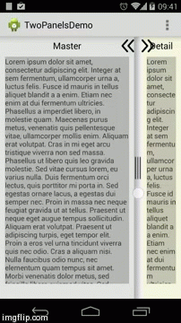

TwoPanels
=========


 TwoPanels is a full customizable library where you can hide and show the fragments in vertical and horizontal and customize the behaviour on orientation changes.
The library have a slider separating the fragments, you can drag this slider and the fragments resize the views inside.

You need to declare in your activity manifest:
```xml
android:configChanges="keyboardHidden|orientation|screenSize"
```


Usage TwoPanelsBaseActivity
=====

```java
public class MainActivity extends TwoPanelsBaseActivity {

	@Override
	public void onCreate(Bundle savedInstanceState) {
		super.onCreate(savedInstanceState);
		MyRightFragment mRightFragment = new MyRightFragment();
		MyLeftFragment mLeftFragment = new MyLeftFragment();
		getFragmentManager().beginTransaction().add(R.id.right, mRightFragment).commit();
		getFragmentManager().beginTransaction().add(R.id.left, mLeftFragment).commit();
	}
```

<table>
	<tr>
		<td><b>Methods</b></td>
		<td><b>Description</b></td>
	</tr>
	<tr>
		<td><b>setSlidersDrawables(int verticalDrawable, int horizontalDrawable)</b></td>
		<td>Set de drawables for the slider in horizontal and vertical like this example: setSlidersDrawables(R.drawable.slider_vertical, R.drawable.slider_horizontal);</td>
	</tr>
	<tr>
		<td><b>setSliderSize(int size)</b></td>
		<td>Set the slider size</b></td>
	</tr>
	<tr>
		<td><b>switchSliderVisitility();</b></td>
		<td>Set the visivility of the slider with an animate effect.</td>
	</tr>
	<tr>
		<td><b>setBaseOrientation(int orientation)</b></td>
		<td>Set the orientation of the panels with the values LinearLayout.VERTICAL or LinearLayout.HORIZONTAL, default is LinearLayout.HORIZONTAL.</td>
	</tr>
	<tr>
		<td><b>slideFragmentsToRight()</b></td>
		<td>Slide the fragments to the right with an animation.</td>
	</tr>
	<tr>
		<td><b>slideFragmentsToLeft()</b></td>
		<td>Slide the fragments to the left with an animation.</b></td>
	</tr>
	<tr>
		<td><b>showTwoFragments()</b></td>
		<td>Show two panels in the screen.</td>
	</tr>
	<tr>
		<td><b>hideRight()</b></td>
		<td>Hide the right panel and show the left panel in full screen.
	</td>
	</tr>
	<tr>
		<td><b>hideLeft()</b></td>
		<td>Hide the left panel and show the right panel in full screen.</td>
	</tr>
	
</table>

Usage RightFragment and LeftFragment
=====

You can use normal fragments or extends from RightFragment and LeftFragment, these fragments have a button for slide the fragments, this button change automatically the drawables on orientation changes of the layout. 

Example:

```java
public class MyRightFragment extends RightFragment {

	@Override
	public View onCreateView(LayoutInflater inflater, ViewGroup container, Bundle savedInstanceState) {
		super.onCreateView(inflater, container, savedInstanceState);
		LinearLayout linear = new LinearLayout(getActivity());
		LayoutInflater layoutInflater = (LayoutInflater) getActivity().getSystemService(Context.LAYOUT_INFLATER_SERVICE);
		layoutInflater.inflate(R.layout.myright_fragment, linear, true);
		LinearLayout linearInParent = (LinearLayout) mContainer.findViewById(R.id.linearRight);
		linearInParent.addView(linear);
		return this.mContainer;
	}
}
```

<table>
	<tr>
		<td><b>Methods</b></td>
		<td><b>Description</b></td>
	</tr>
	<tr>
		<td><b>switchButtonsSliderVisivility()</b></td>
		<td>Toggle the visibility of the slider button.
	</td>
	</tr>
	<tr>
		<td><b>setSliderButtonsDrawables(int, int)</b></td>
		<td>Set the drawables of the slider button according orientation of the layout.</td>
	</tr>
	
</table>

Developed By
============

Antonio Corrales desarrollogit@gmail.com


License
=======

Copyright 2014 Antonio Corrales

    Licensed under the Apache License, Version 2.0 (the "License");
    you may not use this file except in compliance with the License.
    You may obtain a copy of the License at

       http://www.apache.org/licenses/LICENSE-2.0

    Unless required by applicable law or agreed to in writing, software
    distributed under the License is distributed on an "AS IS" BASIS,
    WITHOUT WARRANTIES OR CONDITIONS OF ANY KIND, either express or implied.
    See the License for the specific language governing permissions and
    limitations under the License.

